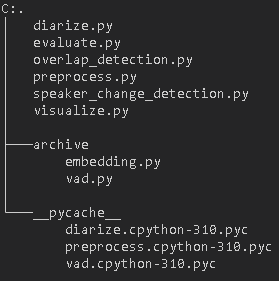

# Speaker Diarization: VAD & Clustering Audio Segments

## 1. Project Overview

This project implements a robust speaker diarization system capable of automatically detecting and segmenting speakers in an audio file. It leverages state-of-the-art Voice Activity Detection (VAD) and speaker clustering techniques using the `pyannote.audio` library to identify speaker boundaries and assign unique labels to each segment.

# File Structure


## 2. Core Features Implemented

*   **Audio Preprocessing:** Handles loading, resampling (to 16kHz), and normalization of audio files.
*   **Voice Activity Detection (VAD):** Utilizes `pyannote.audio`'s `speaker-diarization-3.1` pipeline to accurately identify speech regions.
*   **Speaker Embedding & Clustering:** Integrated within the `pyannote.audio` pipeline, this automatically extracts speaker characteristics and groups speech segments by speaker.
*   **Speaker Label Assignment:** Assigns unique labels (e.g., SPEAKER_00, SPEAKER_01) to identified speakers.
*   **Segment Boundary Output:** Generates diarization results in both CSV and RTTM formats, including start time, end time, and assigned speaker for each segment.
*   **Evaluation Script:** Calculates the Diarization Error Rate (DER) against a ground truth RTTM file to quantify system accuracy.

## 3. Technical Requirements

*   Python 3.7+
*   Standard ML/data libraries: `numpy`, `scipy`, `scikit-learn`, `librosa`, `pytorch`, `pyannote.audio`, `pyannote.core`, `pyannote.metrics`.

## 4. Setup Instructions

1.  **Clone the repository:**
    ```
    git clone https://github.com/your-username/speaker-diarization.git
    cd speaker-diarization
    ```

2.  **Create and activate a virtual environment:**
    ```
    python -m venv venv
    # On Windows:
    # venv\Scripts\activate
    # On macOS/Linux:
    source venv/bin/activate
    ```

3.  **Install dependencies:**
    ```
    pip install -r requirements.txt
    ```

4.  **Hugging Face Authentication & Model Access (CRITICAL!):**
    This project uses pre-trained models from Hugging Face that require user agreement.
    *   Create a free Hugging Face account: [https://huggingface.co/join](https://huggingface.co/join)
    *   Generate an access token: [https://huggingface.co/settings/tokens](https://huggingface.co/settings/tokens) (ensure it has 'read' access).
    *   Login to Hugging Face via your terminal:
        ```
        huggingface-cli login
        # Paste your token when prompted
        ```
    *   **ACCEPT USER CONDITIONS for the following models:**
        *   `pyannote/segmentation-3.0`: [https://huggingface.co/pyannote/segmentation-3.0](https://huggingface.co/pyannote/segmentation-3.0)
        *   `pyannote/speaker-diarization-3.1`: [https://huggingface.co/pyannote/speaker-diarization-3.1](https://huggingface.co/pyannote/speaker-diarization-3.1)
        (You must visit these links while logged into Hugging Face and click to accept the conditions).

## 5. Usage

### 5.1. Prepare Input Audio

Place your `.wav` audio files in the `data/` directory. For example, `data/sample_audio.wav`.

### 5.2. Run Diarization

To process an audio file and generate diarization outputs:

*(Self-correction: Your `diarize.py` currently hardcodes the path. You might want to update it to take a command-line argument for the input file, or document that the user needs to change the path in the script.)*

Outputs (`.csv` and `.rttm` files) will be saved in the `outputs/` directory.

### 5.3. Prepare Ground Truth for Evaluation

For evaluation, you need a manually transcribed ground truth RTTM file.
*   Listen to your audio file (e.g., `data/sample_audio.wav`).
*   Create a corresponding `.rttm` file in the `data/` directory (e.g., `data/sample_audio.rttm`) following the RTTM format:
    `SPEAKER <filename> 1 <start_time> <duration> <NA> <NA> <speaker_name> <NA> <NA>`
    Example `data/sample_audio.rttm`:
    ```
    SPEAKER sample_audio 1 0.00 5.00 <NA> <NA> SpeakerA <NA> <NA>
    SPEAKER sample_audio 1 5.50 3.00 <NA> <NA> SpeakerB <NA> <NA>
    ```

### 5.4. Run Evaluation

To calculate the Diarization Error Rate (DER) against your ground truth:

*(Self-correction: Similar to `diarize.py`, your `evaluate.py` currently hardcodes paths. Consider making it take command-line arguments for the reference and hypothesis files.)*

The script will print the DER and a detailed breakdown of errors to the console.

## 6. Example Input/Output

*   **Example Input:** `data/sample_audio.wav` (Provide a small, clear sample audio file for testing).
*   **Example Ground Truth:** `data/sample_audio.rttm`
*   **Example Output:** `outputs/sample_audio_diarization.csv`, `outputs/sample_audio_diarization.rttm`

## 7. Code Quality & Reproducibility

The code is modular, well-documented, and aims to follow best practices. `requirements.txt` ensures easy dependency management.

## 8. Potential Bonus Features (Future Work)

*   Overlapping Speech Detection (inherently handled to some extent by `pyannote` pipeline)
*   Speaker Change Detection
*   Interactive Visualization
*   Configurable Pipeline (e.g., VAD threshold, number of speakers)
*   Dockerization

---

